# Product Requirements Document (PRD)
## Project AegisTrace: AI-Powered Bitcoin Transaction Investigation Platform
**Document Version:** 1.0.0-PROD  
**Author:** Core System Architecture & AI Forensics Team  
**Target Event:** Smart India Hackathon (SIH) 2026  
**Status:** Approved for Implementation  
**Operating Classification:** Law Enforcement / Intelligence Forensics (Offline-First)

---

## 1. Executive Summary

### 1.1 Product Vision
Project AegisTrace is an enterprise-grade, offline-first cyber investigation and digital forensics platform designed specifically for law enforcement agencies, cyber defense cells, and financial intelligence units (FIUs). The platform ingests heterogeneous cryptographic ledger records and network telemetries, correlates multi-hop blockchain transaction graphs with physical network-layer indicators, and leverages unsupervised machine learning alongside graph topology analytics to detect sophisticated money laundering syndicates, peel chains, and mixing operations—providing court-admissible, fully explainable evidentiary leads.

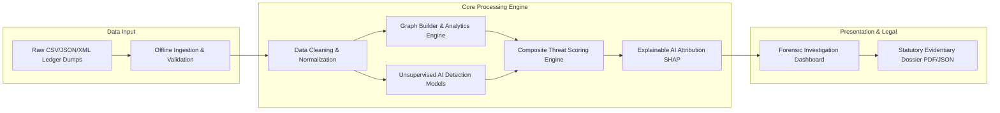

### 1.2 Purpose and Business Justification
Traditional financial fraud investigations rely on centralized banking records with straightforward linear paper trails. In contrast, cybercriminals exploiting Bitcoin leverage pseudonymous, decentralized, and highly automated obfuscation techniques—such as multi-input peel chains, CoinJoin mixers, and rapid money-mule fan-outs—executing thousands of state-transition hops in minutes. Human investigators face cognitive saturation when analyzing massive raw ledger dumps. AegisTrace bridges this operational capability gap by automating the heavy mathematical and graph-theoretic burden, reducing case triage time from weeks to seconds while maintaining statutory evidentiary transparency.

### 1.3 Target Users & Deployment Context
AegisTrace operates inside isolated, air-gapped, or intranet law enforcement networks running Linux environments. It requires zero external internet connectivity during operational forensics, eliminating data leakage risks and ensuring strict chain-of-custody compliance under evidence admissibility standards (e.g., Section 65B of the Indian Evidence Act / Bharatiya Sakshya Adhiniyam).

---

## 2. Problem Statement

### 2.1 Current Investigation Challenges
1. **Transaction Velocity & Volume:** Active ransomware syndicates and darknet vendors execute over 4,000 transactions per hour, dividing illicit funds into micro-UTXOs across dynamic addresses.
2. **Cognitive Saturation in Manual Triage:** Investigators manually querying public block explorers or analyzing spreadsheets cannot compute multi-hop paths, clustering heuristics, or graph centrality metrics in real time.
3. **Complex Obfuscation Topologies:**
   - **Peel Chains:** Rapid linear transfers stripping small amounts to cash-out points while passing remaining bulk balances forward.
   - **Fan-Out / Fan-In:** One-to-many splitting followed by many-to-one aggregation to disguise genesis origins.
   - **Mixing / CoinJoin Pools:** High-entropy transactions combining multiple independent signers into identical output values.
4. **The "Black-Box" AI Dilemma:** Traditional deep learning models output raw risk scores without causal attribution. Unexplained probability scores are legally inadmissible in court hearings and fail to justify asset freezing orders or statutory search warrants.

---

## 3. Project Goals

### 3.1 Functional Goals
- **Heterogeneous Ingestion:** Ingest raw CSV, JSON, and XML transaction datasets and network relay logs up to 500,000 transactions per session without external API dependencies.
- **Automated Entity Resolution:** Group individual Bitcoin addresses into unified entity clusters using Common-Input Ownership Heuristics (CIOH) and behavioral clustering.
- **Topological & Anomaly Detection:** Identify anomalous transaction bursts, peeling patterns, and high-betweenness mixer hubs using Isolation Forests and NetworkX graph algorithms.
- **Explainable Threat Prioritization:** Output composite risk scores (0–100%) accompanied by human-readable causal checklists and mathematical SHAP feature attributions.
- **Forensic Case Export:** Generate court-admissible PDF/JSON case dossiers complete with SHA-256 evidence integrity signatures and audit trails.

### 3.2 Business & Operational Goals
- Compress initial forensic triage duration by **$\ge 95\%$** (reducing multi-week spreadsheet audits to under 60 seconds).
- Standardize forensic evidence gathering across federal, state, and specialized intelligence agencies.

### 3.3 Hackathon (SIH 2026) Deliverable Goals
- Deliver a 100% self-contained, fully working offline prototype demonstrable on a standard Linux workstation.
- Provide end-to-end user workflows: raw file upload $\rightarrow$ graph construction $\rightarrow$ AI anomaly detection $\rightarrow$ interactive visual investigation $\rightarrow$ instant PDF dossier export.

### 3.4 Technical Performance Goals
- Graph generation and AI inference latency $\le 45\text{ seconds}$ for datasets up to 100,000 transactions.
- Memory footprint constrained to $\le 8\text{ GB RAM}$ peak during graph traversal.
- Zero runtime crashes or unhandled exceptions on malformed ledger rows.

---

## 4. Non-Goals (Out of Scope for MVP)

To ensure execution fidelity during SIH 2026, the following items are explicitly out of scope for the MVP:

| Category | Out of Scope Item | Justification / MVP Alternative |
| :--- | :--- | :--- |
| **Blockchain Nodes** | Running a full Bitcoin core node ($>600\text{ GB}$ storage) | MVP utilizes offline batch dumps (CSV/JSON/XML) simulating seized ledgers. |
| **Live Mempool Sync** | Real-time P2P Bitcoin network socket sniffing | Batch offline ledger analysis covers 100% of post-incident forensic requirements. |
| **Exchange Custody** | Direct API integration into foreign crypto exchanges | Law enforcement sub-poena workflows are handled via generated PDF export dossiers. |
| **Asset Seizure** | Automated private key recovery / automated wallet sweeping | Cryptographic private key cracking is mathematically impossible; platform focuses on tracking & attribution. |
| **Non-BTC Chains** | Native parsing of Monero, Ethereum, Solana, or Zcash | MVP specializes strictly in the Bitcoin UTXO model. Cross-chain is slated for Phase 2 roadmap. |

---

## 5. User Personas

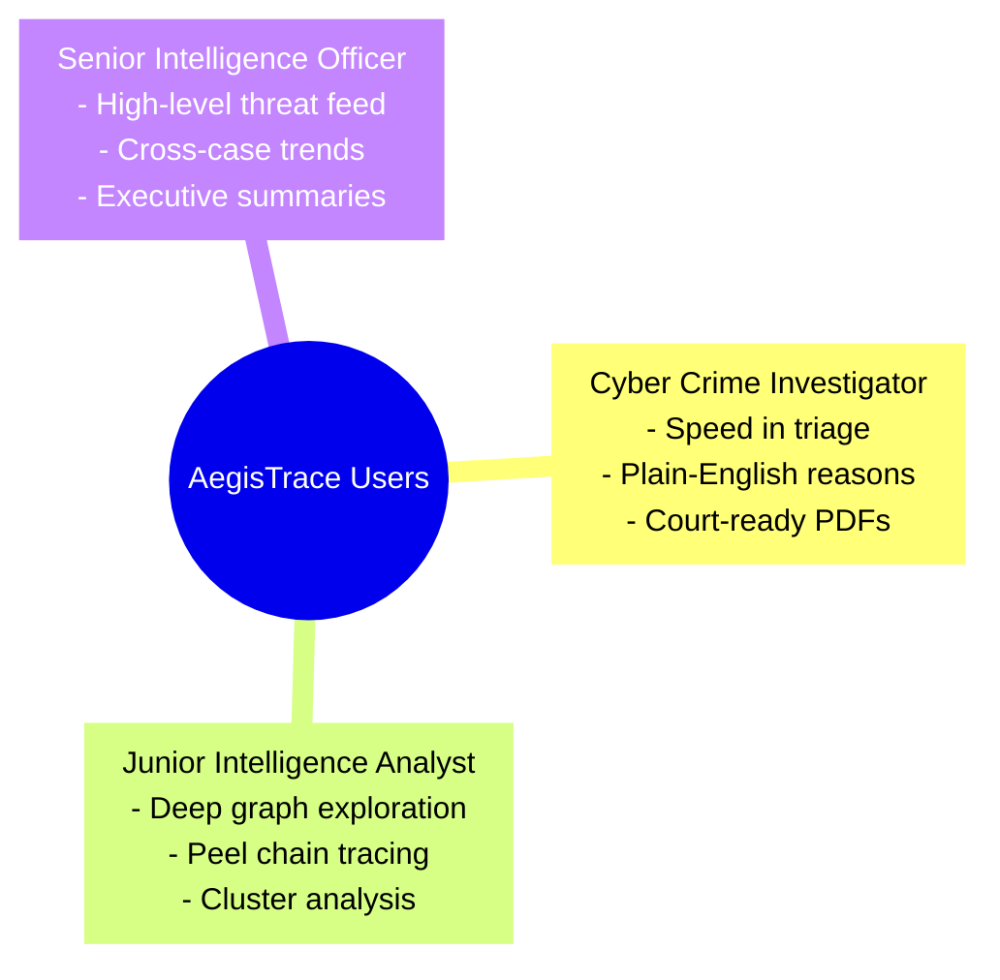

### Persona 1: Inspector Rajesh Varma — Cyber Crime Investigator
- **Role:** Field Investigator, State Cyber Crime Division
- **Background:** Police officer specialized in cyber fraud, ransomware, and extortion cases.
- **Goals:** Quickly determine where extortion funds moved, identify suspect cash-out points, and generate an evidence dossier for court-authorized exchange account freezing.
- **Pain Points:** Overwhelmed by technical crypto jargon; cannot manually parse raw hexadecimal UTXO scripts.
- **Daily Workflow:** Receives victim wallet address $\rightarrow$ Uploads seized ledger dump $\rightarrow$ Reviews top alerts $\rightarrow$ Exports official PDF report.

### Persona 2: Ananya Sharma — Junior Intelligence Analyst
- **Role:** Forensic Analyst, National Intelligence Agency / FIU
- **Background:** Technical degree in Data Science & Cybersecurity.
- **Goals:** Trace complex peel chains, establish entity clustering across 500+ disposable wallets, and map money mule networks.
- **Pain Points:** Tools that lack customizable filtering or fail to visualize multi-hop directed graphs cleanly.
- **Daily Workflow:** Uploads multi-source JSON/CSV files $\rightarrow$ Runs graph queries $\rightarrow$ Inspects node centrality $\rightarrow$ Tags suspected darknet clusters.

### Persona 3: Vikramaditya Roy — Senior Forensic Director / Superintendent
- **Role:** Head of Financial Crimes & Cyber Oversight
- **Background:** 20+ years in law enforcement administration.
- **Goals:** Monitor jurisdictional threat spikes, approve statutory freezing warrants, and ensure evidentiary compliance.
- **Pain Points:** Lack of standardized reporting; risk of cases getting dismissed in court due to unverified "black box" algorithms.
- **Daily Workflow:** Reviews high-level dashboard metrics $\rightarrow$ Audits SHAP feature attributions $\rightarrow$ Signs off on judicial summons.

---

## 6. End-to-End User Journey

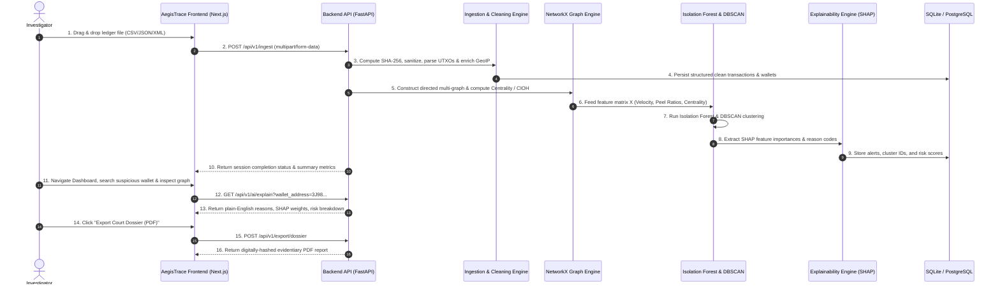

---

## 7. Functional Requirements

### 7.1 Module Matrix & Specifications

| Module ID | Module Name | Priority (MVP/Post-MVP) | Functional Specification |
| :--- | :--- | :--- | :--- |
| **FR-01** | **Authentication & Role RBAC** | MVP | Local JWT-based session auth with role separation: `Admin`, `Lead Investigator`, `Read-Only Analyst`. |
| **FR-02** | **Multi-Format Ingestion** | MVP | Ingest CSV, JSON, and XML files up to $500\text{ MB}$. Validate schema headers, reject malformed rows, compute SHA-256 evidence integrity hash on ingestion. |
| **FR-03** | **Data Cleaning & UTXO Parser** | MVP | Deconstruct multi-input/multi-output transactions, convert satoshis to BTC, normalize timestamps (ISO 8601 UTC), and extract relay IP addresses. |
| **FR-04** | **GeoIP & Network Enrichment** | MVP | Enrich relay broadcaster IPs using offline MaxMind GeoLite2 database to resolve Country, City, ASN, and Tor exit node flag. |
| **FR-05** | **Feature Engineering Engine** | MVP | Compute temporal transaction velocity ($\text{tx}/\text{hr}$), peel chain ratios, fan-out degrees, balance lifespans, and fee anomaly ratios. |
| **FR-06** | **Topological Graph Builder** | MVP | Construct bipartite and wallet-to-wallet directed multi-graphs using NetworkX. Calculate PageRank, In/Out-Degree Centrality, and Betweenness Centrality. |
| **FR-07** | **Entity Resolution (CIOH)** | MVP | Apply Common-Input Ownership Heuristics (CIOH) to collapse multiple input addresses in a single transaction into a single unified entity cluster. |
| **FR-08** | **AI Anomaly Detection** | MVP | Execute Scikit-learn Isolation Forest algorithm on high-dimensional feature vectors to identify anomalous transactions and mule addresses. |
| **FR-09** | **Syndicate Clustering (DBSCAN)** | MVP | Execute density-based spatial clustering (DBSCAN) to group coordinated money-laundering rings operating with similar temporal/volume profiles. |
| **FR-10** | **Explainable AI (XAI)** | MVP | Compute SHAP local feature attributions per flagged entity. Translate numeric splits into deterministic, human-readable reason checklists. |
| **FR-11** | **Dynamic Threat Scoring** | MVP | Calculate composite risk scores ($0\text{--}100\%$) weighted across ML anomalies ($40\%$), Graph Centrality ($25\%$), and Heuristic Rules ($35\%$). |
| **FR-12** | **Investigation Dashboard** | MVP | Interactive UI featuring metric strips, volume timeline charts, geographic distribution charts, threat level filters, and active alert queues. |
| **FR-13** | **Graph Visualizer & Sandbox** | MVP | Canvas/SVG directed graph explorer with zoom, pan, node-click inspection, hop-depth slider ($1\text{--}5\text{ hops}$), and shortest-path pathfinder. |
| **FR-14** | **Wallet & Tx Explorers** | MVP | Dedicated search and tabular explorers for addresses and transaction hashes with multi-column filtering, sorting, and tag metadata. |
| **FR-15** | **Evidentiary PDF Export** | MVP | One-click generation of court-ready PDF forensic dossiers featuring case metadata, chain-of-custody hashes, graph snapshots, and XAI checklists. |
| **FR-16** | **System Audit Logs** | MVP | Immutable local logging of every investigator query, file upload, filter change, and export action for judicial accountability. |

---

## 8. AI/Machine Learning Requirements

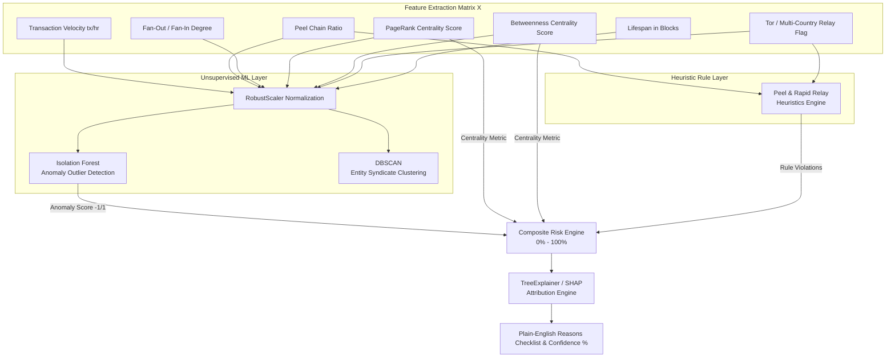

### 8.1 Model Specifications

#### 1. Isolation Forest (Anomaly Detection)
- **Objective:** Detect statistically anomalous wallet behavior without requiring pre-labeled training data (unsupervised).
- **Hyperparameters:** `n_estimators=200`, `max_samples='auto'`, `contamination=0.03`, `random_state=42`.
- **Mathematical Principle:** Anomalous transactions (e.g., sudden massive outflows, sub-minute multi-hop transfers) have distinct feature properties and are isolated near the root of random decision trees with significantly shorter path lengths:
  $$s(x, n) = 2^{-\frac{E(h(x))}{c(n)}}$$
  where $h(x)$ is the path length of observation $x$, $E(h(x))$ is the average path length across all trees, and $c(n)$ is the average path length of unsuccessful searches in a Binary Search Tree.

#### 2. DBSCAN (Density-Based Spatial Clustering of Applications with Noise)
- **Objective:** Group multi-wallet laundering rings and mule syndicates exhibiting coordinated behavioral density.
- **Hyperparameters:** `eps=0.45`, `min_samples=4`, `metric='euclidean'`.
- **Outputs:** Cluster ID integers ($0, 1, 2, \dots$) identifying organized rings, with $-1$ denoting background noise.

### 8.2 Feature Engineering Definitions
1. **Velocity ($V_{\text{tx}}$):** Total transaction count of the subject wallet divided by the active lifespan in hours.
2. **Peel Chain Ratio ($R_{\text{peel}}$):** Ratio of the larger output value to the sum of inputs in a 1-input/2-output transaction:
   $$R_{\text{peel}} = \frac{\max(\text{Out}_1, \text{Out}_2)}{\text{In}_1}, \quad \text{Flagged when } R_{\text{peel}} \in [0.85, 0.99]$$
3. **Entropy of Outputs ($H_{\text{tx}}$):** Shannon entropy of output satoshi distributions detecting CoinJoin mixers:
   $$H = -\sum_{i=1}^{k} p_i \log_2(p_i)$$
   Equal output values result in maximum entropy ($H \rightarrow \log_2 k$).
4. **Relay Geodiversity Index ($G_{\text{IP}}$):** Distinct country count associated with broadcast relay nodes for a single wallet entity.

### 8.3 Composite Risk Scoring Formula
The platform computes a standardized risk score $S_{\text{risk}} \in [0, 100]$:
$$S_{\text{risk}} = \min\left(100, \; \left(w_1 \cdot S_{\text{ML}} + w_2 \cdot S_{\text{Graph}} + w_3 \cdot S_{\text{Heuristic}}\right) \times 100\right)$$
- **Weights:** $w_1 = 0.40$ (Isolation Forest Anomaly Score), $w_2 = 0.25$ (Normalized PageRank & Centrality), $w_3 = 0.35$ (Heuristic Violations).

### 8.4 Model Evaluation & Baseline Benchmarks
Because the platform operates in an unsupervised forensic context, evaluation is benchmarked using:
- **Synthetic Contamination Ingestion Tests:** Verifying $\ge 98\%$ recall on injected peel chain and mixer topologies.
- **Silhouette Coefficient:** Maintaining cluster separation score $\ge 0.65$ on DBSCAN entity clusters.
- **Inference Latency:** Sub-second evaluation ($<800\text{ ms}$) on 10,000 wallet feature vectors.

---

## 9. Graph Analytics Specification

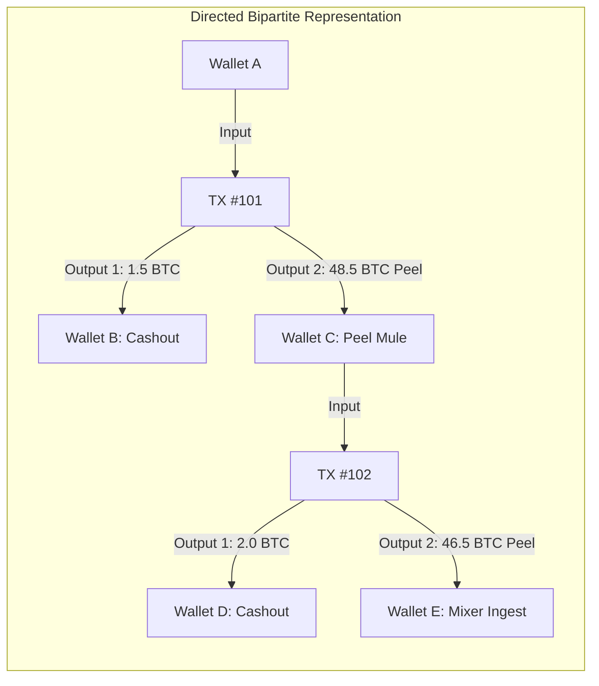

### 9.1 Graph Topological Primitives
- **Vertices ($V$):**
  - Type `WALLET`: Unique Bitcoin address ($P2PKH$, $P2SH$, $Bech32$). Properties: `address`, `balance_btc`, `tx_count`, `risk_score`, `cluster_id`.
  - Type `TRANSACTION`: Unique transaction hash (`txid`). Properties: `txid`, `timestamp`, `total_volume_btc`, `fee_btc`, `is_coinjoin`.
- **Edges ($E$):**
  - Directed transfers: $(u, v) \in V \times V$. Edge weight $W_e = \text{Amount in BTC}$. Attributes: `timestamp`, `txid`, `hop_index`.

### 9.2 Graph-Theoretic Algorithms
1. **Common-Input Ownership Heuristic (CIOH):**
   If $\text{In}_1, \text{In}_2, \dots, \text{In}_k$ are spent together as inputs in transaction $T$, assign all corresponding wallet vertices to a single equivalence set:
   $$\text{Cluster}(\text{In}_a) = \text{Cluster}(\text{In}_b) \quad \forall \; a, b \in \{1, \dots, k\}$$
2. **PageRank Centrality ($PR$):** Identifies prominent laundering aggregators and high-volume transit hubs.
3. **Betweenness Centrality ($C_B$):** Discovers gatekeeper money mules bridging isolated criminal clusters and regulated exchange deposit addresses:
   $$C_B(v) = \sum_{s \neq v \neq t} \frac{\sigma_{st}(v)}{\sigma_{st}}$$
4. **All Shortest Paths (Dijkstra Traversal):** Traces the exact cryptographic trail between a defrauded victim wallet and a liquidated exchange deposit node within $N$ hops.

---

## 10. End-to-End Data Pipeline

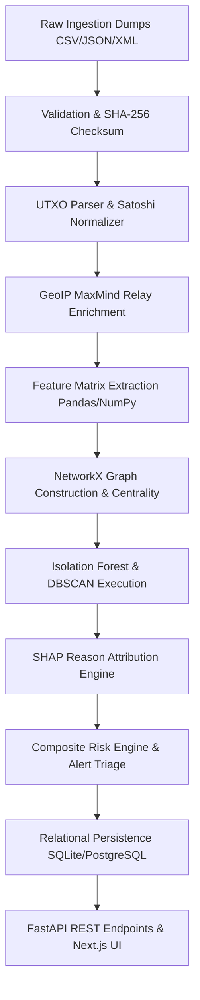

### Pipeline Stage Details & Latency Budgets

| Stage | Process | Input Format | Output Format | Latency Budget ($50\text{k tx}$) |
| :--- | :--- | :--- | :--- | :--- |
| **S1: Ingest** | File upload & stream buffer | Multipart File | Temp file + SHA-256 hash | $< 2.0\text{ s}$ |
| **S2: Validate** | Schema header & type verification | Temp File | Validated stream / Error code | $< 1.0\text{ s}$ |
| **S3: Parse** | Script deconstruction & UTXO mapping | Raw rows | Normalized DataFrames | $< 5.0\text{ s}$ |
| **S4: Enrich** | GeoIP & ASN lookup | IP Strings | Relational IP table | $< 2.0\text{ s}$ |
| **S5: Features** | Temporal rolling windows & peel ratios | Normalized DataFrames | Feature Matrix $X \in \mathbb{R}^{n \times d}$ | $< 6.0\text{ s}$ |
| **S6: Graph** | NetworkX MultiDiGraph generation | Edge list | Graph instance + Centrality dicts | $< 8.0\text{ s}$ |
| **S7: ML Inference** | Isolation Forest & DBSCAN clustering | Scaled Matrix $X_{\text{scaled}}$ | Outlier scores + Cluster IDs | $< 4.0\text{ s}$ |
| **S8: XAI** | TreeExplainer SHAP attribution | ML model + feature instances | Feature weight vectors | $< 5.0\text{ s}$ |
| **S9: Score & Alert** | Composite formula evaluation | ML, Graph, and Heuristic scores | Prioritized alert records | $< 1.5\text{ s}$ |
| **S10: Persist** | Batch relational bulk insert | Structured dataclasses | Relational DB tables | $< 3.5\text{ s}$ |
| **Total Pipeline** | End-to-End Execution | Raw Ledger Dump | Populated Dashboard | **$< 38.0\text{ s}$** |

---

## 11. Backend Architecture & Service Decomposition

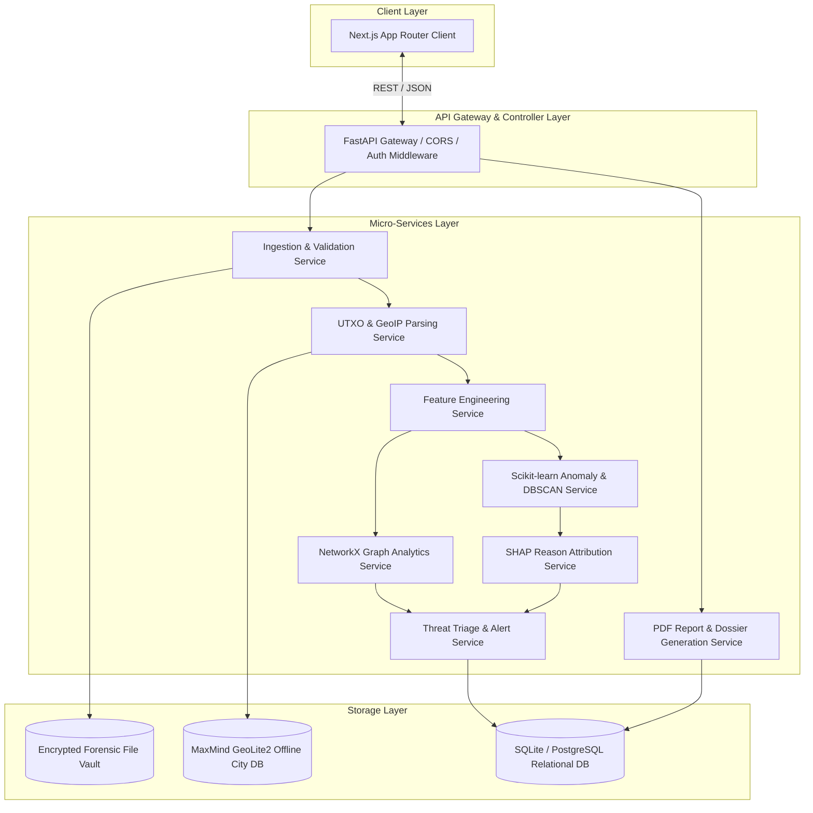

### Backend Service Contracts

1. **Ingestion & Validation Service (`app.services.ingestion`):**
   - Handles multi-part file uploads, calculates cryptographic integrity hashes (SHA-256), and validates MIME headers.
2. **Parser & Enrichment Service (`app.services.parser`):**
   - Decodes inputs/outputs, normalizes satoshi amounts to Bitcoin floats, and performs local MaxMind mmdb lookups for relay IPs.
3. **Graph Analytics Service (`app.services.graph`):**
   - Builds directed multigraph structures using NetworkX. Computes PageRank, betweenness, in/out degree, and executes Dijkstra shortest path traversals.
4. **AI & Anomaly Detection Service (`app.services.ai`):**
   - Manages Scikit-learn pipelines. Executes `IsolationForest.fit_predict` and `DBSCAN.fit_predict`.
5. **Explainability & Attribution Service (`app.services.xai`):**
   - Generates local SHAP explanations for tree models and evaluates deterministic reason code mappings.
6. **Report Generation Service (`app.services.report`):**
   - Uses ReportLab to compile forensic PDF dossiers featuring charts, risk summaries, and case metadata.

---

## 12. Frontend Architecture & Component Hierarchy

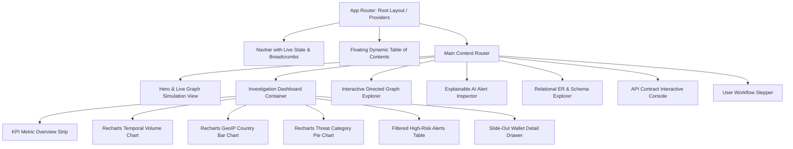

### Frontend State & Technology Architecture
- **Framework:** Next.js 14 (App Router) + React 18.
- **Styling Architecture:** Tailwind CSS with a strict high-contrast monochrome design system (`zinc-950` text on pure white `bg-white`, zero linear/radial gradients, crisp `border-zinc-200` borders).
- **Data Visualization:** Recharts for temporal time-series and categorical charts; native HTML5 SVG/Canvas for interactive directed graph layouts.
- **State Management:** React local state + URL search parameters for filter persistence across searches.

---

## 13. Database Design & Entity Relationship Diagram (ERD)

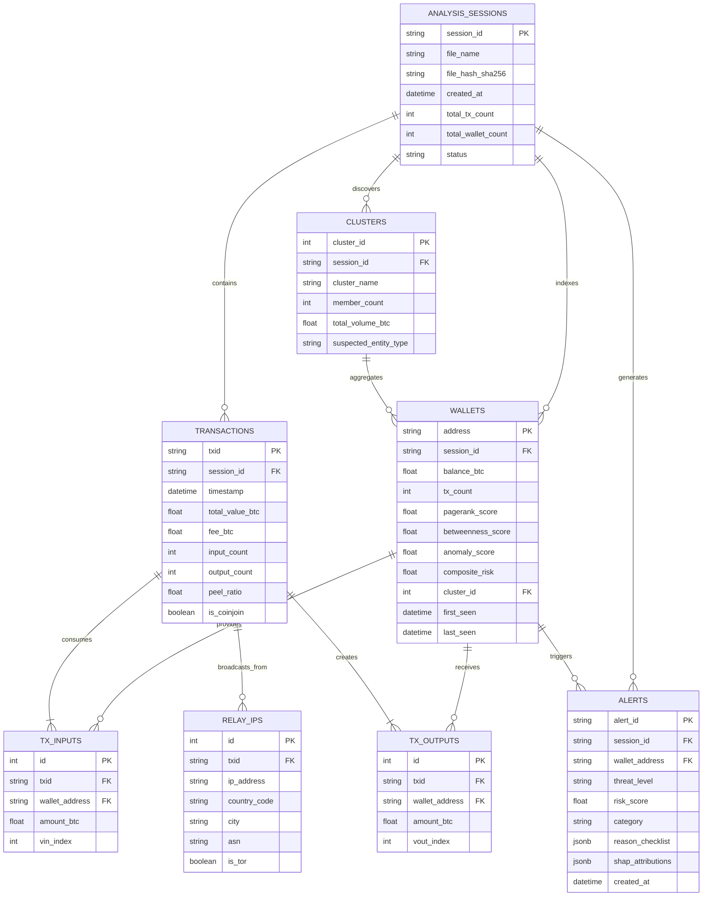

### Relational Schema Specifications & Indexing Strategy

1. **`analysis_sessions` Table:**
   - Tracks unique dataset uploads and ensures cryptographic chain of custody.
   - Primary Key: `session_id` (UUIDv4).
   - Indexes: `idx_session_hash` on `file_hash_sha256`.

2. **`wallets` Table:**
   - Stores computed topological, anomaly, and risk scores per Bitcoin address.
   - Primary Key: `(address, session_id)`.
   - Indexes: `idx_wallet_risk` on `composite_risk DESC`, `idx_wallet_cluster` on `cluster_id`.

3. **`transactions` Table:**
   - Normalized ledger records.
   - Primary Key: `(txid, session_id)`.
   - Indexes: `idx_tx_timestamp` on `timestamp`, `idx_tx_peel` on `peel_ratio`.

4. **`tx_inputs` & `tx_outputs` Tables:**
   - Granular UTXO lineage mapping.
   - Foreign Keys: `txid` $\rightarrow$ `transactions(txid)`, `wallet_address` $\rightarrow$ `wallets(address)`.
   - Indexes: `idx_input_wallet` on `wallet_address`, `idx_output_wallet` on `wallet_address`.

5. **`alerts` Table:**
   - Stores prioritized investigation leads with JSONB blobs containing XAI reason checklists.
   - Primary Key: `alert_id` (UUIDv4).
   - Indexes: `idx_alert_threat` on `threat_level`, `idx_alert_wallet` on `wallet_address`.

---

## 14. API Specifications (RESTful API Contracts)

### 14.1 Summary API Endpoint Matrix

| Method | Endpoint | Description | Auth Required |
| :--- | :--- | :--- | :--- |
| `POST` | `/api/v1/ingest` | Upload raw ledger dump (CSV/JSON/XML) & initiate pipeline | Bearer JWT |
| `GET` | `/api/v1/sessions/{id}/status` | Retrieve asynchronous ingestion & processing progress | Bearer JWT |
| `GET` | `/api/v1/sessions/{id}/metrics` | Summary KPI metrics for the overview dashboard | Bearer JWT |
| `GET` | `/api/v1/graph/subgraph` | Query $N$-hop neighborhood graph for a given wallet | Bearer JWT |
| `GET` | `/api/v1/graph/shortest-path` | Compute shortest money path between source & destination | Bearer JWT |
| `POST` | `/api/v1/ai/detect-anomalies` | Trigger on-demand anomaly detection with custom weights | Bearer JWT |
| `GET` | `/api/v1/ai/explain` | Retrieve SHAP attributions & human-readable checklist | Bearer JWT |
| `GET` | `/api/v1/alerts/feed` | Paginated and filtered queue of active threat alerts | Bearer JWT |
| `POST` | `/api/v1/export/dossier` | Generate court-admissible PDF forensic case report | Bearer JWT |

---

### 14.2 Granular Endpoint Payloads

#### 1. Ingest Dataset (`POST /api/v1/ingest`)
- **Request (Multipart Form):**
  - `file`: Binary file stream (`.csv`, `.json`, `.xml`).
  - `case_reference`: `string` (e.g., `"SIH-2026-CYBER-904"`).
- **Response (`202 Accepted`):**
```json
{
  "session_id": "9b1deb4d-3b7d-4bad-9bdd-2b0d7b3dcb6d",
  "file_name": "seized_ledger_mempool_dump.csv",
  "file_size_bytes": 14589200,
  "sha256_checksum": "e3b0c44298fc1c149afbf4c8996fb92427ae41e4649b934ca495991b7852b855",
  "status": "PROCESSING",
  "estimated_completion_seconds": 25
}
```

#### 2. Query Subgraph (`GET /api/v1/graph/subgraph`)
- **Query Parameters:** `session_id=...&wallet_address=3J98t1WpEZ73CNmQviecrnyiWrnqRhWNLy&hops=2`
- **Response (`200 OK`):**
```json
{
  "focus_wallet": "3J98t1WpEZ73CNmQviecrnyiWrnqRhWNLy",
  "hop_depth": 2,
  "nodes": [
    {
      "id": "3J98t1WpEZ73CNmQviecrnyiWrnqRhWNLy",
      "label": "Wallet 3J98... (Focus)",
      "type": "wallet",
      "balance_btc": 23.90,
      "risk_score": 92.4,
      "cluster_id": 4
    },
    {
      "id": "1FeexV6bAHb8ybZjqQMjJrcCrHGW9sb6uF",
      "label": "Wallet 1Fee... (Darknet)",
      "type": "wallet",
      "balance_btc": 12.50,
      "risk_score": 95.0,
      "cluster_id": 4
    }
  ],
  "edges": [
    {
      "source": "3J98t1WpEZ73CNmQviecrnyiWrnqRhWNLy",
      "target": "1FeexV6bAHb8ybZjqQMjJrcCrHGW9sb6uF",
      "txid": "8f8b3de3198a287a98f121d58231aa7d0912f2c",
      "amount_btc": 12.50,
      "timestamp": "2026-08-30T18:24:12Z"
    }
  ]
}
```

#### 3. Explainable AI Attribution (`GET /api/v1/ai/explain`)
- **Query Parameters:** `session_id=...&wallet_address=3J98t1WpEZ73CNmQviecrnyiWrnqRhWNLy`
- **Response (`200 OK`):**
```json
{
  "wallet_address": "3J98t1WpEZ73CNmQviecrnyiWrnqRhWNLy",
  "composite_risk_score": 92.4,
  "threat_level": "CRITICAL",
  "confidence_percentage": 96.2,
  "reasons_checklist": [
    "High transaction velocity (18.4 tx/hr vs network median 0.2)",
    "Peel chain intermediary pattern detected (Peel ratio: 0.94)",
    "One-hop proximity to sanctioned Darknet Entity (Wallet 1Fee...)",
    "Relay transactions broadcast from 4 distinct high-risk ASNs"
  ],
  "shap_feature_attributions": [
    { "feature": "Transaction Velocity (tx/hr)", "shap_value": 0.34, "relative_weight": "+34%" },
    { "feature": "Peel Chain Output Ratio", "shap_value": 0.28, "relative_weight": "+28%" },
    { "feature": "Tor / Relay IP Diversity", "shap_value": 0.18, "relative_weight": "+18%" },
    { "feature": "Graph Betweenness Centrality", "shap_value": 0.12, "relative_weight": "+12%" }
  ],
  "recommended_investigative_action": "Issue Section 91 CrPC notice to downstream KYC Exchange deposit node."
}
```

---

## 15. Security, Privacy & Air-Gapped Operation

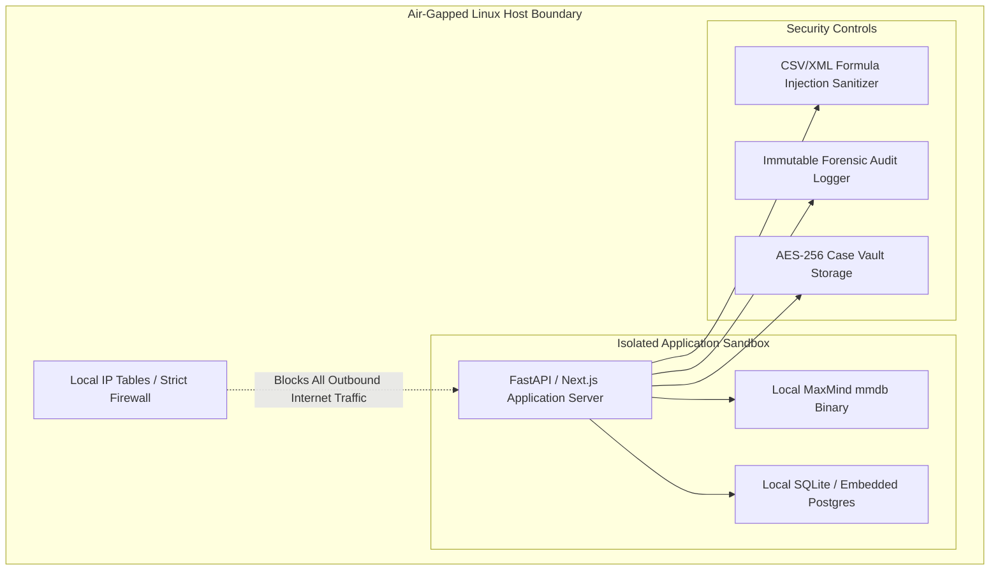

### 15.1 Core Security Directives
1. **Zero External Egress (Air-Gap Compliance):** The application contains zero outbound network requests. All dependencies (fonts, icons, JS packages, MaxMind IP databases) are bundled locally.
2. **CSV Formula Injection Mitigation:** All ingested string cells starting with dangerous characters (`=`, `+`, `-`, `@`, `\t`, `\r`) are sanitized and stripped of formula execution capabilities before SQLite persistence.
3. **Evidence Immutability & Integrity:** Raw ingested datasets are stored in read-only directories with SHA-256 hashes generated at the exact second of ingestion to maintain legal chain of custody.
4. **Local Audit Logging:** All user actions (searches, node clicks, filter applications, dossier downloads) are appended to a cryptographically sealed local audit trail (`audit_log.jsonl`).

---

## 16. Explainability & Legal Evidence Standards

```mermaid
graph LR
    ML[Unsupervised ML Trees & Centrality] -->|Extract Splits| SHAP[SHAP TreeExplainer Engine]
    SHAP -->|Mathematical Attribution| Weights[Feature Weights Matrix]
    Weights -->|Deterministic Template Engine| PlainEng[Human-Readable Forensic Reasons]
    PlainEng -->|Formatted Section| LegalPDF[Court-Admissible Dossier PDF]
    LegalPDF -->|Statutory Standard| Judge[Admissible in Judicial Court Proceedings]
```

### 16.1 Statutory Evidentiary Compliance
To satisfy statutory requirements (such as Indian Evidence Act §65B / Bharatiya Sakshya Adhiniyam):
- Every alert generated by AegisTrace includes a deterministic checklist explaining *why* the address was flagged.
- Mathematical SHAP weights provide an auditable rationale showing which behavioral dimensions (e.g., velocity, peel ratio, mixer proximity) caused the risk score to exceed threshold parameters.
- PDF exports bundle the software version, system timestamp, parameters, model configuration, and input file SHA-256 hash.

---

## 17. Dashboard Page-by-Page Specifications

### Page 1: Executive Overview (`/dashboard`)
- **Top Metrics Strip:** Total Volume ($3,840.50\text{ BTC}$), Flagged Volume ($482.50\text{ BTC}$), Wallets Analyzed ($1,248$), Active Alerts ($72$).
- **Visuals:** 24-hour temporal anomaly volume spike line chart, GeoIP country distribution bar chart, threat category pie chart.
- **Triage Queue:** Top 10 critical alerts requiring immediate investigator review.

### Page 2: Interactive Graph Explorer (`/graph`)
- **Canvas:** Directed multi-graph visualizer with zoom/pan, node-click inspector, and edge volume labeling.
- **Controls:** Hop depth slider ($1\text{--}5\text{ hops}$), layout selector (Force-directed, Circular, Hierarchical), Risk threshold filter.
- **Pathfinder Tool:** Input `Source Wallet` and `Target Wallet` to trace the shortest money path through peel chains and mixers.

### Page 3: Explainable AI & Alert Center (`/alerts`)
- **Filter Bar:** Filter by Threat Level (`CRITICAL`, `HIGH`, `MEDIUM`, `LOW`), Category (`Peel Chain`, `Mixer`, `Ransomware`), Country.
- **Detail View:** Side-by-side alert view displaying the Flagged Wallet card, SHAP feature importance bar graph, and court dossier preview.

### Page 4: Relational Database & API Console (`/architecture`)
- **ERD Visualizer:** Interactive schema explorer for the 6 core tables.
- **API Sandbox:** Interactive endpoint tester with real-time JSON payload viewer and copy tool.

---

## 18. UX/UI & Accessibility Requirements

- **Design System:** Strict monochrome high-contrast dark/zinc and white palette (pure white background, zinc-950 headings, zinc-700 body, `#2563eb` active highlights, zero gradients).
- **Typography:** Google `Space_Mono` loaded locally for monospace precision in wallet hashes, amounts, and JSON keys.
- **Keyboard Shortcuts:**
  - `/`: Focus search bar.
  - `Esc`: Close open modals/drawers.
  - `G + D`: Navigate to Dashboard.
  - `G + G`: Navigate to Graph Explorer.
  - `E`: Export current view to PDF.
- **Empty States:** Clear onboarding placeholders with drag-and-drop file upload zones and pre-packaged demo datasets ("Load SIH 2026 Sample Ransomware Case").

---

## 19. Non-Functional & Performance Requirements

| Metric Category | Requirement Specification | Measurement & Validation Method |
| :--- | :--- | :--- |
| **Dataset Ingestion Size** | Ingest up to $500,000\text{ transactions}$ per single file | Automated stress testing with synthesized Bitcoin ledger dumps |
| **End-to-End Processing** | $\le 45\text{ seconds}$ total pipeline execution on $100\text{k records}$ | Benchmark timing on standard 8-core Linux workstation |
| **Memory Constraint** | Peak RAM $\le 8\text{ GB}$ during graph traversal and ML scaling | Memory profiling via `tracemalloc` and Linux `htop` |
| **Graph Query Latency** | Subgraph $2\text{-hop}$ neighborhood rendering in $< 500\text{ ms}$ | Chrome DevTools Network & Performance profiling |
| **System Reliability** | Zero crashes on corrupted rows; 100% graceful error rejection | Fuzz testing with malformed CSV/JSON files containing nulls/NaNs |

---

## 20. Technology Stack & Architectural Justifications

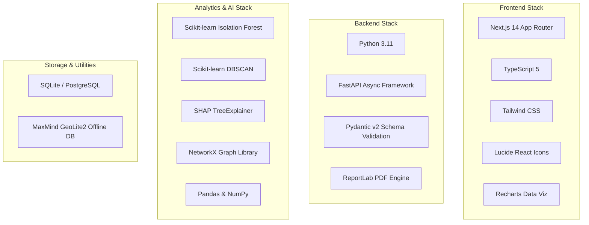

### Justification Matrix

| Component | Selected Technology | Alternative Considered | Technical Justification for AegisTrace |
| :--- | :--- | :--- | :--- |
| **Frontend Framework** | **Next.js 14 (App Router)** | Plain React SPA | Server components, built-in routing, superior typography rendering, production-ready static generation. |
| **Backend Framework** | **Python FastAPI** | Node.js Express / Django | Native asynchronous execution, automated OpenAPI/Swagger documentation, direct zero-overhead integration with Python ML/graph data structures. |
| **Graph Engine** | **NetworkX** | Neo4j / Dgraph | Pure Python in-memory graph execution; zero external database daemon requirement; ideal for self-contained, air-gapped forensic deployments. |
| **Anomaly ML** | **Scikit-learn (Isolation Forest)** | TensorFlow / PyTorch | Lightweight CPU-optimized execution; zero GPU requirement; mathematically superior for high-dimensional anomaly isolation without labeled data. |
| **Explainability** | **SHAP (Shapley Values)** | LIME | Mathematically consistent, game-theoretic feature attribution suitable for judicial evidentiary standards. |
| **PDF Generation** | **ReportLab** | Puppeteer Headless Chrome | Direct programmatic PDF compilation with minimal memory overhead ($<30\text{ MB}$ vs $>500\text{ MB}$ for headless Chromium). |

---

## 21. Complete Project Folder Structure

```
SIH/
├── docs/                                  # Engineering & Architectural Specifications
│   ├── PRD_BITCOIN_INVESTIGATION.md       # Master Product Requirements Document
│   └── API_SPECIFICATION.md               # Detailed REST API Specifications
├── backend/                               # Python FastAPI Offline Forensic Backend
│   ├── app/
│   │   ├── __init__.py
│   │   ├── main.py                        # FastAPI entrypoint & middleware configuration
│   │   ├── config.py                      # Application settings & environment variables
│   │   ├── api/
│   │   │   ├── v1/
│   │   │   │   ├── endpoints/
│   │   │   │   │   ├── ingest.py          # Multi-format upload & parsing routes
│   │   │   │   │   ├── graph.py           # Subgraph & shortest-path query routes
│   │   │   │   │   ├── ai.py              # Anomaly detection & clustering routes
│   │   │   │   │   ├── alerts.py          # Prioritized threat feed routes
│   │   │   │   │   └── export.py          # Evidentiary PDF generation routes
│   │   │   │   └── api_router.py          # Unified v1 API router
│   │   ├── core/
│   │   │   ├── security.py                # JWT auth, sanitization & hashing
│   │   │   └── logger.py                  # Cryptographic audit logging
│   │   ├── models/                        # SQLAlchemy / SQLModel database models
│   │   │   ├── session.py
│   │   │   ├── wallet.py
│   │   │   ├── transaction.py
│   │   │   └── alert.py
│   │   ├── schemas/                       # Pydantic v2 request/response schemas
│   │   │   ├── ingest_schema.py
│   │   │   ├── graph_schema.py
│   │   │   └── alert_schema.py
│   │   ├── services/                      # Modular Business Logic Layer
│   │   │   ├── ingestion_service.py       # Validation & SHA-256 computation
│   │   │   ├── parser_service.py          # CSV/JSON/XML parsing & Satoshi normalization
│   │   │   ├── geoip_service.py           # Offline MaxMind GeoLite2 resolver
│   │   │   ├── feature_service.py         # Velocity, peel ratios & entropy math
│   │   │   ├── graph_service.py           # NetworkX graph construction & centrality
│   │   │   ├── ai_service.py              # Isolation Forest & DBSCAN models
│   │   │   ├── xai_service.py             # SHAP local attribution & reason generator
│   │   │   ├── scoring_service.py         # Composite threat risk engine
│   │   │   └── report_service.py          # ReportLab PDF dossier compiler
│   │   └── data/                          # Embedded Static Assets (Air-Gapped)
│   │       ├── GeoLite2-City.mmdb         # MaxMind local database
│   │       └── sample_ransomware_case.csv # SIH demonstration dataset
│   ├── tests/                             # Backend Test Suite
│   │   ├── test_ingestion.py
│   │   ├── test_graph_centrality.py
│   │   └── test_ai_detection.py
│   ├── requirements.txt                   # Pinned Python Dependencies
│   └── Dockerfile                         # Self-contained Linux container definition
├── src/                                   # Next.js 14 Frontend Application
│   ├── app/
│   │   ├── layout.tsx                     # Root layout with Space Mono & meta
│   │   ├── globals.css                    # Tailwind CSS tokens & typography
│   │   ├── page.tsx                       # Complete interactive documentation & demo
│   │   └── dashboard/                     # (Future) Standalone operational dashboard view
│   ├── components/                        # Modular React UI Components (19 Components)
│   │   ├── Navbar.tsx
│   │   ├── HeroSection.tsx
│   │   ├── ProblemStatementSection.tsx
│   │   ├── SystemArchitectureSection.tsx
│   │   ├── DataPipelineSection.tsx
│   │   ├── GraphAnalyticsSection.tsx
│   │   ├── AiDetectionSection.tsx
│   │   ├── ExplainableAiSection.tsx
│   │   ├── InvestigationDashboardMockup.tsx
│   │   ├── ApiArchitectureSection.tsx
│   │   ├── DbSchemaSection.tsx
│   │   ├── UserWorkflowSection.tsx
│   │   ├── FutureEnhancementsSection.tsx
│   │   ├── FinalSummarySection.tsx
│   │   └── Footer.tsx
│   ├── data/                              # Static Mock Datasets & Schemas (7 Data Files)
│   │   ├── pipelineData.ts
│   │   ├── apiData.ts
│   │   ├── dbSchemaData.ts
│   │   ├── mockDashboardData.ts
│   │   ├── techStackData.ts
│   │   ├── roadmapData.ts
│   │   └── futureEnhancementsData.ts
│   └── lib/
│       └── utils.ts                       # Class merging (clsx + tailwind-merge)
├── package.json
├── tailwind.config.ts
├── tsconfig.json
└── README.md
```

---

## 22. Step-by-Step Development Roadmap

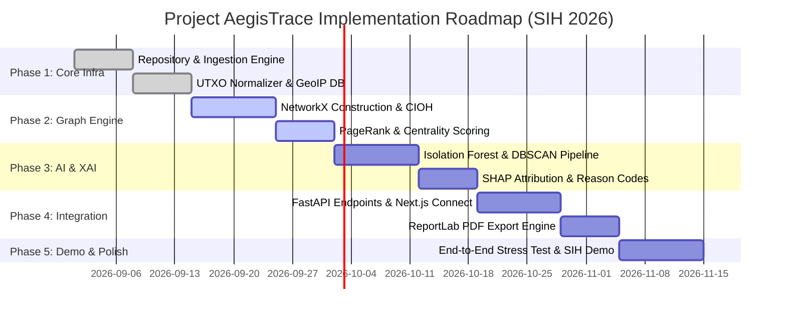

### Detailed Phase Deliverables

- **Phase 1: Ingestion & Core Data Foundation (Weeks 1–2):**
  - Implement FastAPI multipart file ingestion with SHA-256 validation.
  - Build multi-format CSV/JSON/XML parsers converting satoshis to BTC and mapping UTXOs.
  - Embed local MaxMind GeoLite2 IP database.
- **Phase 2: Graph Modeling & Topological Centrality (Weeks 3–4):**
  - Build NetworkX directed bipartite graph constructor.
  - Implement Common-Input Ownership Heuristics (CIOH) for wallet entity clustering.
  - Code PageRank, Betweenness Centrality, and Dijkstra shortest money path algorithms.
- **Phase 3: AI Anomaly Detection & Explainability Engine (Weeks 5–6):**
  - Implement feature matrix extractor (velocity, peel ratios, fan-outs, lifespans).
  - Train and evaluate Scikit-learn Isolation Forest and DBSCAN models.
  - Integrate SHAP TreeExplainer and deterministic plain-English reason generator.
- **Phase 4: API Integration, Dashboard & PDF Dossier (Weeks 7–8):**
  - Connect FastAPI REST endpoints to Next.js frontend.
  - Implement ReportLab court-admissible PDF dossier export with SHA-256 hashes.
- **Phase 5: Performance Optimization & Hackathon Pitch (Weeks 9–10):**
  - Run stress tests on $500\text{k transaction}$ datasets.
  - Finalize offline demo package with packaged sample ransomware cases.

---

## 23. Technical Risks & Mitigation Strategies

| Risk Category | Risk Description | Severity | Mitigation Strategy |
| :--- | :--- | :--- | :--- |
| **Performance** | Memory exhaustion during NetworkX graph construction on $>500\text{k transactions}$. | **HIGH** | Implement batch chunk processing; prune single-hop disconnected micro-dust nodes below $0.0001\text{ BTC}$. |
| **AI Reliability** | False positives in Isolation Forest flagging normal high-volume commercial wallets (e.g., BitPay/Exchanges). | **MEDIUM** | Apply exchange whitelist heuristics and balance anomaly weights ($40\%$) with graph centrality ($25\%$) and peel rules ($35\%$). |
| **Security** | Malicious CSV injection executing formulas on investigator workstations. | **HIGH** | Enforce strict regex string sanitization stripping leading `=`, `+`, `-`, `@` characters on all input fields. |
| **Operational** | Reliance on external web assets causing UI failure in air-gapped demo environments. | **CRITICAL** | Bundle all fonts (Space Mono), icons (Lucide SVG), and JS dependencies locally; zero external CDN calls. |

---

## 24. Future Roadmap & Post-SIH Vision

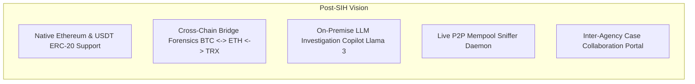

1. **Multi-Cryptocurrency & Cross-Chain Forensics:** Native decoding of Ethereum (Account-based model), Tron, and stablecoins (USDT/USDC) across decentralized cross-chain bridges.
2. **On-Premise Local LLM Copilot:** Integration of a locally quantized Llama-3 model allowing investigators to query cases using natural language (*"Show me all wallets within 2 hops of the victim that liquidated to Binance after 18:00 UTC"*).
3. **Live Mempool Anomaly Sniffing:** Background daemon monitoring unconfirmed transactions to flag money laundering attempts prior to block confirmation.

---

## 25. Appendix: Terminology, Schemas & Formal Reference

### 25.1 Domain Glossary
- **UTXO (Unspent Transaction Output):** The fundamental accounting unit in Bitcoin. Transactions consume existing UTXOs as inputs and generate new UTXOs as outputs.
- **Peel Chain:** A money laundering pattern where a large initial fund is transferred through a sequence of transactions, peeling off a small amount to a cash-out address at each step while forwarding the bulk balance.
- **CoinJoin / Mixer:** A privacy protocol combining inputs from multiple independent participants into identical output amounts, obscuring the cryptographic link between senders and receivers.
- **CIOH (Common-Input Ownership Heuristic):** The standard forensic heuristic assuming that all input addresses spent together within a single multi-input Bitcoin transaction are controlled by the same private key entity.
- **SHAP (SHapley Additive exPlanations):** A game-theoretic approach to explain the output of machine learning models by calculating the contribution of each feature to the final prediction.

### 25.2 System State Transition Diagram

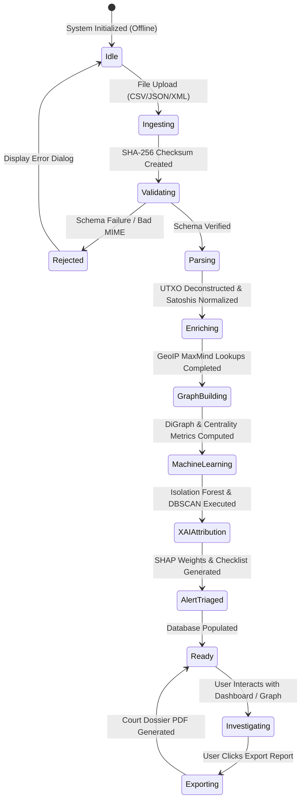

---
*End of Product Requirements Document — Project AegisTrace (SIH 2026)*
